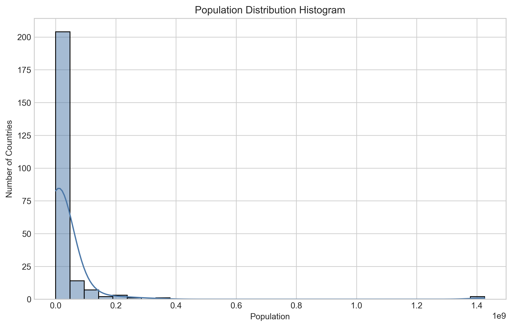
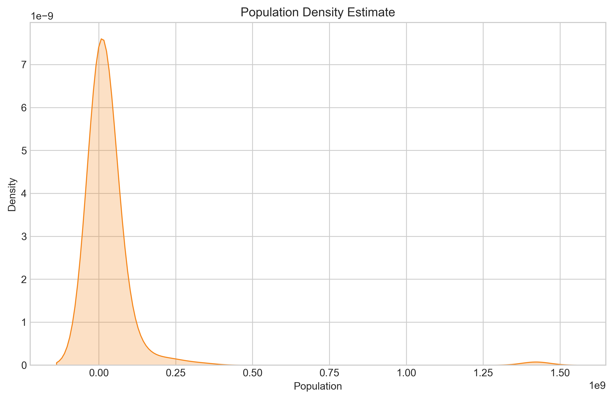
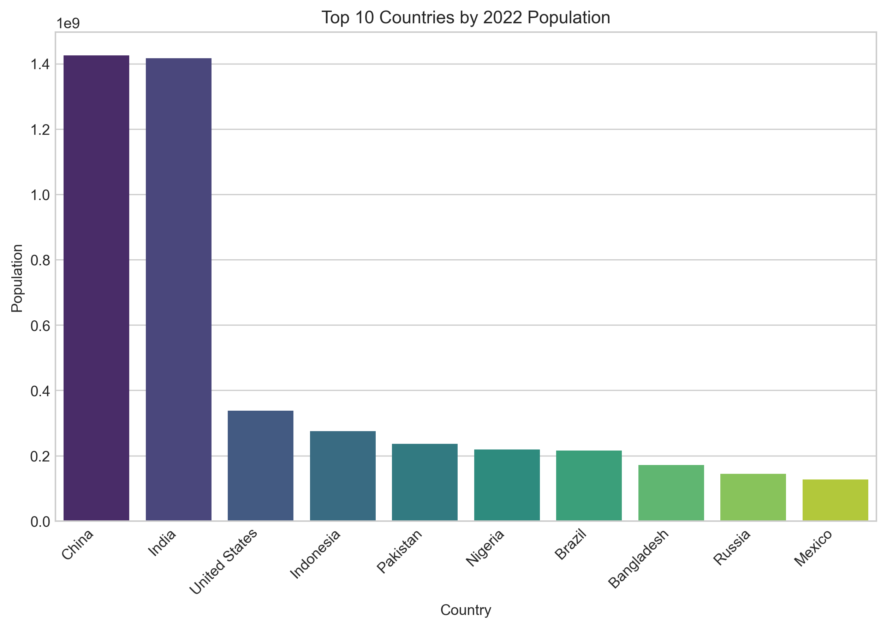
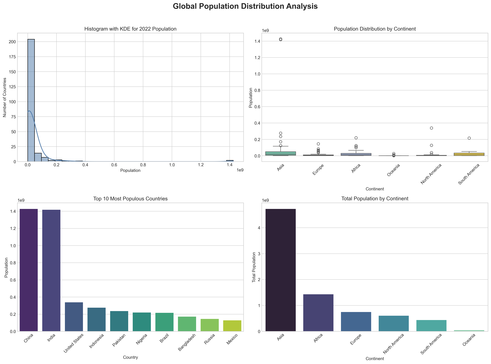

# 🌍 Global Population Distribution Analysis

> **Prodigy InfoTech Data Science Internship | Task 01**

---

## 📖 Project Overview

This project was completed as part of the **Prodigy InfoTech Data Science Internship**.

The objective is to analyze the global population dataset using Python and perform Exploratory Data Analysis (EDA) to visualize population distribution across countries and continents.

The project demonstrates practical data analysis skills using **Pandas**, **NumPy**, **Matplotlib**, and **Seaborn**.

---

## 🎯 Objective

- Analyze the World Population Dataset
- Perform Exploratory Data Analysis (EDA)
- Visualize population distribution
- Identify trends and patterns
- Derive meaningful insights from the data

---

## 📂 Dataset

**Dataset:** World Population Dataset

**Features include:**

- Country/Territory
- Capital
- Continent
- Population (1970–2022)
- Growth Rate
- Density
- Area
- World Population Percentage

---

## 🛠 Technologies Used

| Technology | Purpose |
|------------|---------|
| Python | Programming |
| Pandas | Data Analysis |
| NumPy | Numerical Computing |
| Matplotlib | Data Visualization |
| Seaborn | Statistical Visualization |
| Jupyter Notebook | Development Environment |

---

## 📊 Project Workflow

```
Dataset
   │
   ▼
Load Data
   │
   ▼
Data Cleaning
   │
   ▼
Exploratory Data Analysis
   │
   ▼
Visualization
   │
   ▼
Insights
```

---

## 📈 Visualizations

## 📊 Visualizations

### Population Distribution Histogram



---

### Population Distribution KDE



---

### Top 10 Most Populated Countries



---

### Combined Analysis Dashboard



---

## 🔍 Key Insights

- Asia has the highest population among all continents.
- India and China dominate the global population.
- Population distribution is highly right-skewed.
- Most countries have moderate growth rates.
- Historical population values are strongly correlated.

---

## 📁 Repository Structure

```
PRODIGY_DS_01
│
├── Dataset
├── Notebook
├── Images
├── README.md
├── requirements.txt
├── LICENSE
└── .gitignore
```

---

## ▶️ Installation

Clone the repository

```bash
git clone https://github.com/YOUR_USERNAME/PRODIGY_DS_01.git
```

Install dependencies

```bash
pip install -r requirements.txt
```

Open the notebook

```
Notebook/Task01.ipynb
```

Run all cells.

---

## 🚀 Future Improvements

- Interactive dashboard using Plotly
- Power BI dashboard
- Population prediction using Machine Learning
- Streamlit deployment

---

## 👨‍💻 Author

**K. Praveen Kumar**

B.Tech Computer Science (Data Science)

CMR University

Data Science Intern @ Prodigy InfoTech

---
⭐ If you found this project helpful, consider giving it a star!